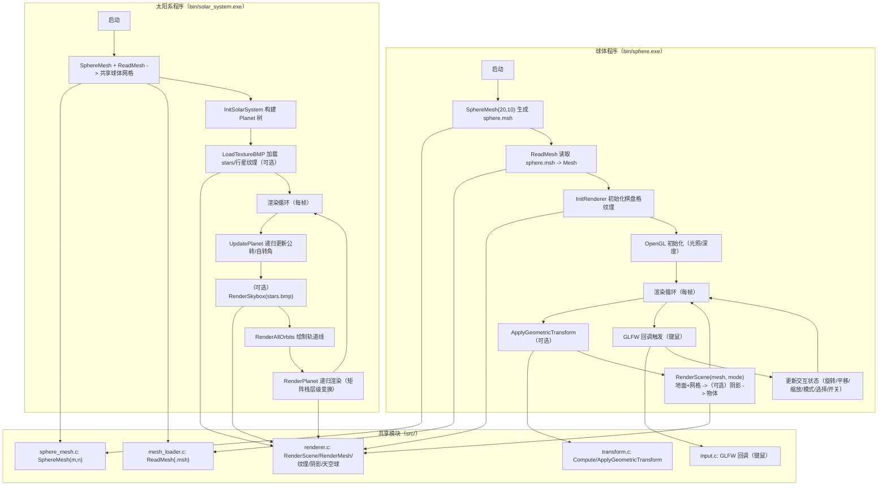

# 图形学与虚拟现实课程实验报告（模板）

> 说明：本文档仅为**报告结构与写作要点清单**。请你用自己的理解补全叙述、数据与分析，并将截图贴入对应位置（满足“不得使用 AI 撰写”的要求）。

---

## 1. 基本信息

- 课程名称：【待填写】
- 实验名称：【待填写】（球面网格建模与交互渲染 / 太阳系拓展）
- 姓名/学号/班级：【待填写】
- 指导教师：【待填写】
- 完成日期：【待填写】

## 2. 摘要与关键词

### 2.1 摘要（建议 150~250 字）

【写作骨架（请用你自己的话补成 150~250 字，避免“笔记式”）】
【目标】实现球面网格建模（.msh 输出）与交互式渲染系统，并扩展实现太阳系层级建模与真实感效果。
【方法】使用 `SphereMesh(m,n)` 生成网格并写入 `.msh`；用 `ReadMesh` 解析到 `Mesh` 结构；基于 OpenGL 固定管线实现点/线/面三种绘制，并加入光照/材质、程序内棋盘格纹理、地面与阴影等效果；使用 GLFW 回调实现键鼠交互，并提供两点映射的几何变换（T/S/R）。
【结果】给出点/线/面切换（`1/2/3`）、纹理/阴影开关（`F3/F2`）、拾取高亮、以及太阳系（星空背景/轨道线/土星环等）效果截图，并描述主要现象。
【亮点】模块化结构（网格/读取/渲染/交互/变换解耦）；支持三角形+四边形混合面；太阳系使用矩阵栈实现层级变换并配置差异化材质参数。
【不足】阴影为简化“压平投影”近似；拾取为阈值近似判定（非严格射线求交）；纹理接缝与极点畸变仍可能存在（可在讨论中说明并给出改进方向）。

### 2.2 关键词

球面网格；`.msh` 文件格式；OpenGL（固定管线）；GLFW；点/线/面绘制；纹理映射（UV）；光照与材质；阴影（平面投影近似）；键鼠交互；拾取；层级建模；太阳系模拟

## 3. 实验环境与运行方法

### 3.1 环境

- 操作系统：Windows 10
- 编译器/工具链：MinGW-w64 GCC（版本见 `gcc --version`）
- 图形接口：OpenGL（固定管线）
- 窗口与输入：GLFW（说明：实验要求写 GLUT，本项目采用**等价的 GLFW 回调机制**实现窗口创建、键鼠交互）

### 3.2 工程结构（简述）

- `src/`：源代码
- `include/`：头文件
- `bin/`：可执行文件与纹理资源（BMP）/网格文件
- `lib/`：第三方库（glfw）

### 3.3 编译与运行

> 将你实际使用的命令粘贴在此处（与 README 一致即可）

- 球体程序编译命令（与 `README.md` 一致）：
  - `gcc src/main.c src/sphere_mesh.c src/mesh_loader.c src/renderer.c src/input.c src/transform.c -o bin/sphere.exe -I include -L lib -lglfw3dll -lopengl32 -lgdi32 -lm`
- 太阳系程序编译命令（与 `README.md` 一致）：
  - `gcc src/solar_system.c src/sphere_mesh.c src/mesh_loader.c src/renderer.c src/input.c src/transform.c -o bin/solar_system.exe -I include -L lib -lglfw3dll -lopengl32 -lgdi32 -lm`
- 运行方式（客观说明，可直接照做）：
  - 建议在 `bin/` 目录内运行程序（使相对路径资源能被找到）
  - 球体程序：会在当前目录生成/读取 `sphere.msh`
  - 太阳系程序：以相对路径加载 `*.bmp`（如 `sun.bmp`、`stars.bmp` 等）
  - 纹理缺失时的降级表现（按当前实现）：
    - 缺失行星纹理：控制台打印失败信息，行星改用预设颜色渲染（仍可运行）
    - 缺失 `stars.bmp`：控制台提示并禁用星空天空球（仍可运行）
  - 建议在 `bin/` 目录内运行程序：太阳系纹理以相对路径（如 `sun.bmp`、`stars.bmp`）加载，且球体程序会在当前目录生成/读取 `sphere.msh`。

## 4. 总体设计

### 4.1 功能目标概述

【完成情况（按当前代码可核对）】
- 任务 1（网格建模与输出）：实现 `SphereMesh(m,n,"sphere.msh")` 生成球面顶点/边/面并输出 `.msh`（支持三角形+四边形面）
- 任务 2（读取网格）：实现 `ReadMesh("sphere.msh",&mesh)` 解析 header/顶点/边/面，面大小用 `faceSizes` 支持 3/4 点
- 任务 3（三种绘制）：实现点/线/面三种模式绘制，按 `1/2/3` 切换（`g_renderMode`：0/1/2）
- 任务 4（几何变换）：按 `T` 控制台输入 Q1/Q2，计算平移+缩放+旋转，使 `P1=(0,0,1)→Q1`、`P2=(0,0,-1)→Q2`
- 任务 5（真实感）：光照（`GL_LIGHT0`）、程序内棋盘格纹理（`F3` 开关）、地面与简化平面阴影（`F2` 开关）
- 任务 6（交互）：键盘旋转/平移/缩放；鼠标拖拽旋转/平移、滚轮缩放；左键点击触发简化拾取（选中高亮）
- 拓展（太阳系）：层级建模（太阳-行星-卫星）、星空背景、轨道线、土星环倾角、太阳自发光与差异化材质/光照衰减

### 4.2 模块划分与职责（建议配图）

【客观描述 + 句子骨架（你可在每条后补一句“为什么这样设计/好处是什么”）】
- `sphere_mesh`：根据经纬参数 (m,n) 生成球面网格并写入 `.msh`，统一数据格式供后续加载与渲染复用
- `mesh_loader`：解析 `.msh` 文件到 `Mesh`（顶点/边/面/faceSizes），对三角形与四边形进行统一存储
- `renderer`：负责点/线/面绘制、纹理坐标计算、棋盘格纹理生成、地面与阴影、（拓展）天空球渲染
- `transform`：根据输入 Q1/Q2 计算并应用平移/缩放/旋转（在 `ModelView` 上叠加几何变换）
- `input`：GLFW 键盘/鼠标回调，维护全局交互状态（旋转/平移/缩放/模式切换/开关/拾取）
- `solar_system`：定义 `Planet` 数据结构，递归更新公转/自转并用矩阵栈实现层级渲染，配置材质与特效

- 网格生成：生成球面顶点/边/面并输出 `.msh`
- 网格读取：读取 `.msh` 到内存 Mesh 结构
- 渲染模块：点/线/面绘制 + 光照/纹理/阴影/天空球
- 变换模块：输入 Q1/Q2，计算并应用几何变换
- 交互模块：键盘/鼠标回调，控制旋转/平移/缩放、模式切换、拾取
- 拓展模块：太阳系层级建模（太阳-行星-卫星）与材质/轨道/土星环等

### 4.3 数据流（建议画流程图）

SphereMesh(生成 `.msh`) → ReadMesh(解析为 `Mesh`) → 初始化 OpenGL/纹理/光照 → 主循环渲染（应用交互变换/几何变换 → RenderScene/RenderPlanet） → GLFW 回调处理输入（更新旋转/平移/缩放/模式/开关/选择） → 下一帧再次渲染

（图 1：系统结构/数据流示意图，占位）

*图 1 图注：系统结构与数据流示意图（Mermaid）。展示共享模块（网格生成/读取/渲染/交互/变换）与两套程序（球体与太阳系）的初始化流程及每帧更新-渲染链路。*

---

## 5. 任务1：球面网格建模与文件输出（SphereMesh）

### 5.1 数学模型与离散方式

单位球参数方程（半径 1）：
- `x = sin(ϕ) cos(θ)`
- `y = sin(ϕ) sin(θ)`
- `z = cos(ϕ)`

离散方式（与 `src/sphere_mesh.c` 一致）：
- 经度：`θ_i = 2π i / m`，`i=0..m-1`
- 纬度：`ϕ_j = π j / n`，`j=1..n-1`（两极单独处理）
- 极点：北极 `(0,0,1)`，南极 `(0,0,-1)`

### 5.2 顶点编号规则（必须写清楚）

编号顺序（与 `src/sphere_mesh.c` 的写入一致）：
- `0`：北极点 `(0,0,1)`
- `1 .. (n-1)*m`：按纬线圈从上到下依次写入（`j=1..n-1`），每圈按经度 `i=0..m-1` 写入
  - 第 `j` 圈（`j=1..n-1`）起始索引：`start = 1 + (j-1)*m`
- `nV-1`：南极点 `(0,0,-1)`

编号的好处（写作要点）：便于通过 `start` 快速定位“某一圈”的顶点范围，并用 `(i+1)%m` 处理环向闭合，生成边/面时实现更直接。

### 5.3 边与面构建方法

边（Edges）构建（与 `src/sphere_mesh.c` 一致）：
- 北极到第一圈：`(0, 1+i)`
- 圈与圈之间“经线边”（竖向）：第 `j` 圈与第 `j+1` 圈同经度相连
- 最后一圈到南极：`(last_ring+i, south_idx)`
- 每一圈内部“纬线边”（环向闭合）：`(start+i, start+(i+1)%m)`

面（Faces）构建（与 `src/sphere_mesh.c` 一致）：
- 上极帽：m 个三角形 `0, 1+i, 1+(i+1)%m`
- 中间条带：每相邻两圈构成 m 个四边形 `cur+i, next+i, next+i_next, cur+i_next`
- 下极帽：m 个三角形 `last+(i+1)%m, last+i, south`

顶点顺序与法线（写作要点）：渲染时使用顶点坐标近似法线（单位球上 `n≈p`），因此面顶点顺序保持一致可避免部分面出现“背面/翻转”的视觉问题。

### 5.4 `.msh` 文件格式与输出内容说明

文件格式（与 `SphereMesh` 输出、`ReadMesh` 读取一致）：
- 第 1 行：`nV nE nF`
- 接着 `nV` 行：每行一个顶点坐标 `x y z`
- 接着 `nE` 行：每行一条边 `v1 v2`（两个顶点索引）
- 接着 `nF` 行：每行一个面，可能是三角形 `v1 v2 v3` 或四边形 `v1 v2 v3 v4`

（图 2：`.msh` 文件片段，占位）

【在此插入截图：图 2】

*图 2 图注：【待填写：展示 nV nE nF 与部分顶点/边/面数据】*

### 5.5 自检与正确性验证

【自检要点（可按你截图与运行现象填写“是/否 + 证据截图编号”）】
- 数量公式是否一致：`nV = 2 + (n-1)m`，`nF = 2m + (n-2)m`，`nE = nV + nF - 2`
- 线框模式：每圈是否闭合、经线是否连通到两极、无明显断裂/飞线
- 上下极帽：是否形成 m 个三角形扇面且连接正确
- 不同 (m,n) 对比：m/n 增大时球面更平滑，但顶点/面数增加导致绘制开销上升（可写主观流畅度或帧率变化）

（可选：写 2~3 组不同 m,n 的对比与现象）

### 5.6 对应源码位置（请在正文引用）

- **源码文件**：`src/sphere_mesh.c`，头文件：`include/sphere_mesh.h`
- **核心函数**：`SphereMesh(int m, int n, const char *fileName)`
- **实现要点（按当前代码）**：
  - 顶点数：`nV = 2 + (n - 1) * m`（北极+南极 + (n-1)圈纬线，每圈 m 个点）
  - 面数：`nF = 2 * m + (n - 2) * m`（上下极帽各 m 个三角形 + (n-2)圈之间每圈 m 个四边形）
  - 边数：使用欧拉公式计算：`nE = nV + nF - 2`
  - 顶点写入顺序：先北极 → 从 `j=1..n-1` 写入每圈 `i=0..m-1` → 最后南极
  - 面类型：上/下极帽为三角形，中间条带为四边形；顶点按逆时针写入

---

## 6. 任务2：读取网格文件（ReadMesh）

### 6.1 接口设计与数据结构

接口与数据结构（与 `include/mesh_loader.h` 一致）：
- 函数：`void ReadMesh(const char *fileName, Mesh *meshOut)`
  - 输入：`.msh` 文件路径 `fileName`
  - 输出：`meshOut` 内部动态分配并填充 `nV/nE/nF` 与 `vertices/edges/faces/faceSizes`
- `Mesh` 字段：
  - `vertices`：`nV*3` 的 float 数组（按 `x,y,z` 线性存储）
  - `edges`：`nE*2` 的 int 数组（每条边两个端点索引）
  - `faces`：`nF*4` 的 int 数组（每面最多 4 个顶点索引）
  - `faceSizes`：`nF` 的 int 数组（取值 3 或 4）
- 三角形/四边形支持：
  - 三角形面：第 4 个槽写 `-1`，并记录 `faceSizes[i]=3`
  - 四边形面：写满 4 个索引，记录 `faceSizes[i]=4`

### 6.2 解析流程与异常处理

解析流程（与 `src/mesh_loader.c` 一致）：
- 打开文件失败：打印错误并返回
- 若 `meshOut` 中已有旧内存：先 `free` 并置空，避免重复读入造成泄漏
- 读取 header：`fscanf` 读 `nV nE nF`，失败则报 “Invalid header” 并返回
- 分配内存：按 `nV*3`、`nE*2`、`nF*4`、`nF` 分配四个数组
- 读取顶点与边：用 `fscanf` 顺序读取
- 读取面：`fgets` 逐行 + `sscanf`，通过返回的 `count` 判断 3 点或 4 点并写入 `faceSizes`

### 6.3 对应源码位置（请在正文引用）

- **源码文件**：`src/mesh_loader.c`，头文件：`include/mesh_loader.h`
- **核心数据结构**：`Mesh`（`nV/nE/nF` + `vertices/edges/faces/faceSizes`）
- **核心函数**：`ReadMesh(const char *fileName, Mesh *meshOut)`
- **实现要点（按当前代码）**：
  - 先释放 `meshOut` 中旧内存，再重新分配（避免重复读入造成泄露）
  - `faces` 统一按每面最多 4 个顶点存储，三角形第 4 项写 `-1`，并用 `faceSizes[i]` 记录 3/4
  - 面读取：逐行 `fgets` + `sscanf`，用返回的 `count` 判断是 3 点还是 4 点

---

## 7. 任务3：点/边/面三种绘制效果

### 7.1 三种绘制模式的实现

实现方式（与 `src/renderer.c` 一致）：
- 点模式：`glBegin(GL_POINTS)` 遍历 `mesh->vertices`（每 3 个 float 一个顶点）
- 边模式：`glBegin(GL_LINES)` 遍历 `mesh->edges`，对每条边取两个端点索引再取顶点坐标
- 面模式：遍历 `mesh->faces` 与 `mesh->faceSizes`
  - `faceSizes[i]==4` 用 `GL_QUADS`
  - `faceSizes[i]==3` 用 `GL_TRIANGLES`
  - 法线：用顶点坐标近似法线（单位球上 `n≈p`）

### 7.2 模式切换交互

按键与现象（与 `src/input.c` 一致）：
- 按 `1`：进入点模式，屏幕呈现离散点云（球面采样点）
- 按 `2`：进入边模式，呈现经纬线构成的线框球
- 按 `3`：进入面模式，呈现填充球面，并可观察到光照/纹理/阴影效果（若开启）

（图 3：点模式；图 4：线框模式；图 5：面模式，占位）

【在此插入截图：图 3】

*图 3 图注：【待填写】*

【在此插入截图：图 4】

*图 4 图注：【待填写】*

【在此插入截图：图 5】

*图 5 图注：【待填写】*

### 7.3 对应源码位置（请在正文引用）

- **源码文件**：`src/renderer.c`，头文件：`include/renderer.h`
- **核心函数**：
  - `RenderPoints(const Mesh* mesh)`：遍历 `mesh->vertices`，使用 `GL_POINTS`
  - `RenderEdges(const Mesh* mesh)`：遍历 `mesh->edges`，使用 `GL_LINES`
  - `RenderFaces(const Mesh* mesh)` / `RenderMesh(const Mesh* mesh, int mode)`：按 `faceSizes` 绘制 `GL_QUADS` 或 `GL_TRIANGLES`
- **模式切换（渲染模式变量）**：
  - `g_renderMode`: `0=Points, 1=Edges, 2=Faces`（定义在 `src/main.c`/`src/solar_system.c`，由 `src/input.c` 维护）

---

## 8. 任务4：几何变换（P1→Q1，P2→Q2）

### 8.1 问题定义

已知单位球两点：`P1=(0,0,1)`（北极），`P2=(0,0,-1)`（南极）。用户输入 `Q1/Q2` 后，目标是计算一个由**平移 T + 缩放 S + 旋转 R** 组成的几何变换，使得变换后的球体满足：`P1→Q1` 且 `P2→Q2`（变换在渲染时叠加到 `ModelView` 上生效）。

### 8.2 变换分解与矩阵顺序

分解策略（与 `src/transform.c` 一致）：
- 平移：球心移动到 `mid=(Q1+Q2)/2`
- 缩放：单位球直径为 2，设 `dist=|Q1-Q2|`，则缩放因子 `s=dist/2`
- 旋转：将 `zAxis=(0,0,1)` 旋转到 `v=normalize(Q1-Q2)`；角度 `acos(dot(zAxis,v))`；旋转轴 `cross(zAxis,v)`
- 退化处理：当 `|Q1-Q2|` 很小或旋转轴长度接近 0 时，做特殊分支避免数值不稳定

矩阵/调用顺序（写作要点）：代码按 `Translate → Rotate → Scale` 叠加到 `ModelView`。你可结合截图说明：顺序改变会导致“先缩放再平移/旋转”的结果不同（例如平移量会受缩放影响等）。

### 8.3 文本输入界面与流程

流程（与 `src/input.c`/`src/transform.c` 一致）：
- 按 `T`：控制台提示输入 `Q1(x y z)` 与 `Q2(x y z)`
- `scanf` 读入后调用 `ComputeGeometricTransform(q1,q2)` 计算平移/缩放/旋转参数并保存到内部状态
- 渲染循环每帧调用 `ApplyGeometricTransform()`，因此从下一帧开始生效（并可在控制台看到打印的变换参数）

（图 6：输入界面；图 7：变换前后对比，占位）

【在此插入截图：图 6】

*图 6 图注：【待填写】*

【在此插入截图：图 7】

*图 7 图注：【待填写】*

### 8.4 对应源码位置（请在正文引用）

- **源码文件**：`src/transform.c`，头文件：`include/transform.h`
- **核心函数**：
  - `ComputeGeometricTransform(float q1[3], float q2[3])`：计算平移/缩放/旋转参数
  - `ApplyGeometricTransform()`：在 `ModelView` 上依次 `Translate → Rotate → Scale`
- **实现要点（按当前代码）**：
  - 平移：将球心移动到 `mid=(Q1+Q2)/2`
  - 缩放：`g_scaleGeom = |Q1-Q2| / 2`（原始 P1-P2 距离为 2）
  - 旋转：将 `zAxis=(0,0,1)` 旋到 `v = normalize(Q1-Q2)`；角度 `acos(dot)`，轴为 `cross(zAxis, v)`
  - 退化处理：当 `|Q1-Q2|` 很小或旋转轴长度接近 0 时做特殊处理（避免数值问题）
- **触发输入位置**：`src/input.c` 中按 `T` 键 `scanf` 读入 Q1/Q2 并调用 `ComputeGeometricTransform`

---

## 9. 任务5：真实感绘制（光照/阴影/贴图等）

### 9.1 光照模型与材质参数

光照与材质（与 `src/main.c`/`src/solar_system.c` 一致）：
- 球体程序：开启 `GL_LIGHT0`，光源位置 `light_pos=(5,5,10,1)`；启用 `GL_COLOR_MATERIAL`，用当前颜色参与材质计算
- 太阳系程序：太阳为点光源在原点，设置 ambient/diffuse/specular，并加入距离衰减（constant/linear/quadratic）
- 材质：太阳使用 `GL_EMISSION` 模拟自发光；行星为每个天体配置独立的 `ambient/diffuse/specular/shininess`
- 法线：面绘制时用顶点坐标近似法线（单位球上 `n≈p`）
【写作要点】可描述：光源位置变化会导致明暗与高光移动；材质的 specular/shininess 改变会带来不同“反光强度与锐利度”。

### 9.2 纹理映射（UV）

纹理映射（与 `src/renderer.c` 一致）：
- 纹理：程序内生成 64×64 棋盘格纹理（`InitRenderer`）
- UV 计算（球面参数化）：
  - `u = 0.5 + atan2(z, x) / (2π)`
  - `v = 0.5 - asin(y) / π`
- 开关：按 `F3` 调用 `ToggleTexture()` 切换显示
【写作要点】可讨论：`atan2` 会在经度 ±π 处产生接缝；极点附近纹理压缩导致畸变，属于球面参数化常见现象。

### 9.3 阴影实现

阴影实现（与 `src/renderer.c` 的 `RenderScene` 一致）：
- 地面平面：`groundY = -1.5`，先绘制地面四边形并叠加网格线作为参照
- 阴影策略：在 `mode==2` 且开启阴影时，再绘制一次模型，使用“压平近似”把模型压到地面附近
  - 为避免 z-fighting，做轻微偏移：`glTranslatef(0.1f, -1.49f, 0.1f)`
  - 压平：`glScalef(1.0f, 0.001f, 1.0f)`
- 开关：按 `F2` 调用 `ToggleShadows()` 切换
【写作要点（改进方向）】该方法不是严格的光源投影矩阵，可能出现漂浮/穿插/方向不随光源变化等问题；可改为平面投影矩阵（Planar Shadow Matrix）或 shadow mapping。

（图 8：纹理开关对比；图 9：阴影开关对比，占位）

【在此插入截图：图 8】

*图 8 图注：【待填写】*

【在此插入截图：图 9】

*图 9 图注：【待填写】*

### 9.4 对应源码位置（请在正文引用）

- **源码文件**：`src/renderer.c`，头文件：`include/renderer.h`
- **纹理**：
  - `InitRenderer()`：生成棋盘格纹理（程序内生成，非外部文件）
  - `ToggleTexture()`：切换纹理显示开关（`F3`）
  - `TexCoord(x,y,z)`：球面 UV（按当前实现：`u=0.5+atan2(z,x)/(2π)`，`v=0.5-asinf(y)/π`）
- **光照**：
  - 球体程序：`src/main.c` 中启用 `GL_LIGHT0`，设置光源位置与 `GL_COLOR_MATERIAL`
  - 法线：在面绘制时用顶点坐标近似法线（单位球上 `n≈p`）
- **阴影**：
  - `ToggleShadows()`：切换阴影开关（`F2`）
  - `RenderScene()`：先画地面与网格，再在 `mode==2` 时画“压平近似阴影”（当前实现为简化版本，可在讨论章节说明局限）

---

## 10. 任务6：交互（键盘 + 鼠标）

### 10.1 键盘交互

键盘映射（与 `src/input.c` 一致）：
- `Esc`：退出
- `F1`：系统复位（旋转/缩放/平移/模式/变换/选择）
- `F2`：阴影开关
- `F3`：纹理开关
- `1/2/3`：点/线/面模式
- `T`：控制台输入 Q1/Q2，触发两点映射变换
- 方向键：旋转（每次 5°）
- `W/A/S/D`：平移
- `+/-` 或小键盘加减：缩放

### 10.2 鼠标交互

鼠标交互（与 `src/input.c` 一致）：
- 左键拖动：旋转
- 右键/中键拖动：平移
- 滚轮：缩放
- 左键点击（移动距离 < 5 像素视为点击）：触发简化拾取逻辑，切换 `g_isSelected`（选中高亮）
  - 当前实现为“点击点到窗口中心距离 < 阈值” 的近似判定（便于演示交互效果）

（图 10：拾取前后对比；图 11：交互示例，占位）

【在此插入截图：图 10】

*图 10 图注：【待填写】*

【在此插入截图：图 11】

*图 11 图注：【待填写】*

### 10.3 对应源码位置（请在正文引用）

- **源码文件**：`src/input.c`，头文件：`include/input.h`
- **键盘映射（按当前实现）**：
  - `Esc`：退出
  - `F1`：复位（旋转/缩放/平移/模式/变换/选择）
  - `F2`：阴影开关（`ToggleShadows`）
  - `F3`：纹理开关（`ToggleTexture`）
  - `1/2/3`：点/线/面模式（设置 `g_renderMode`）
  - `T`：控制台输入 Q1/Q2，触发两点映射变换
  - 方向键：旋转（`g_rotX/g_rotY`）
  - `W/A/S/D`：平移（`g_panX/g_panY`）
  - `+/-` 或小键盘加减：缩放（`g_scale`）
- **鼠标交互（按当前实现）**：
  - 左键拖动：旋转
  - 右键/中键拖动：平移
  - 滚轮：缩放
  - 左键“点击”（移动距离小于阈值）：触发简化拾取逻辑，切换 `g_isSelected`（在 `src/main.c` 中用红色高亮）
- **窗口回调注册位置**：`src/main.c` / `src/solar_system.c` 中 `glfwSetKeyCallback` 等

---

## 11. 拓展：太阳系模拟系统

### 11.1 层级建模与运动学（公转/自转）

层级建模（与 `src/solar_system.c` 一致）：
- 以太阳 `g_sun` 为根节点，`children` 保存 8 大行星；地球节点包含月球子节点
- 每帧递归更新：`UpdatePlanet` 累加 `orbitAngle/selfAngle`（公转/自转角）
- 递归渲染：`RenderPlanet` 使用矩阵栈（`glPushMatrix/glPopMatrix`）维护层级
  - 公转：`Rotate(orbitAngle)` → `Translate(distance,0,0)`
  - 自转与绘制：`Rotate(selfAngle)` → `Scale(radius)` → 绘制球体网格（贴图或纯色）

### 11.2 真实感增强效果

真实感增强（与 `src/solar_system.c`/`src/renderer.c` 一致）：
- 星空背景：加载 `stars.bmp`，用大尺度“内表面球体”渲染天空球（`RenderSkybox`）
- 轨道线：`RenderOrbit/RenderAllOrbits` 绘制半透明圆形轨道
- 土星环：`RenderSaturnRing` 绘制环形带，并施加 27° 倾角
- 太阳自发光：太阳节点使用 `GL_EMISSION` 模拟自发光
- 行星材质差异：每个行星设置不同 ambient/diffuse/specular/shininess
- 光照衰减：设置点光源的 constant/linear/quadratic attenuation，增强距离衰减效果

### 11.3 纹理资源说明

纹理资源（与 `bin/` 目录与代码一致）：
- 放置路径：建议把所有 `*.bmp` 放在运行工作目录（推荐直接在 `bin/` 中运行）
- 文件清单（示例）：`stars.bmp`、`sun.bmp`、`mercury.bmp`、`venus.bmp`、`earth.bmp`、`moon.bmp`、`mars.bmp`、`jupiter.bmp`、`saturn.bmp`、`uranus.bmp`、`neptune.bmp`（以及可选 `pluto.bmp`）
- 缺失降级（按当前实现）：
  - 行星纹理缺失：控制台打印失败信息，改用预设颜色渲染
  - `stars.bmp` 缺失：控制台提示并禁用星空背景（仍可运行）
（提示：当前实现使用相对路径加载纹理，运行工作目录应包含这些 `.bmp` 文件，例如在 `bin/` 中运行。）

（图 12：太阳系全景；图 13：地月特写；图 14：土星环特写，占位）

【在此插入截图：图 12】

*图 12 图注：【待填写】*

【在此插入截图：图 13】

*图 13 图注：【待填写】*

【在此插入截图：图 14】

*图 14 图注：【待填写】*

### 11.4 对应源码位置（请在正文引用）

- **源码文件**：`src/solar_system.c`
- **核心要点（按当前实现）**：
  - 数据结构：`Planet`（距离、半径、自转/公转速度与角度、纹理 ID、材质参数、子节点数组等）
  - 更新：`UpdatePlanet` 每帧累加公转/自转角度（递归更新子节点）
  - 渲染：`RenderPlanet` 使用矩阵栈实现层级变换（公转 rotate → translate → 自转 rotate → scale）
  - 真实感：太阳使用 `GL_EMISSION` 自发光；行星设置不同材质（ambient/diffuse/specular/shininess）
  - 星空背景：加载 `stars.bmp`，`RenderSkybox` 渲染大球内表面贴图
  - 轨道线：`RenderOrbit` / `RenderAllOrbits`
  - 土星环：`RenderSaturnRing` + 27° 倾角

---

## 12. 结果分析与讨论（建议写“现象→原因→改进”）

- m,n 对网格质量与性能的影响：【句子骨架】当 m/n 增大时，球面更平滑（如图 X），但顶点/面数增加导致绘制开销上升（可写你机器上的帧率变化或主观流畅度对比）。
- 纹理接缝与极点 UV 的处理与问题：【句子骨架】接缝来自 `u` 的 `atan2` 周期性（经度 ±π 处跳变）；极点处 `v` 聚集导致纹理压缩与畸变（可结合图 8 说明）。
- 阴影的逼真度与局限（穿插/漂浮/锯齿等）：【句子骨架】当前阴影为压扁近似，不能随光源方向变化，且与地面可能有轻微穿插/漂浮；可改用平面投影矩阵或 shadow mapping。
- 拾取精度与交互体验：【句子骨架】当前拾取为“点击接近屏幕中心”的阈值近似，优点是实现简单、演示稳定；不足是无法精确命中边缘区域；可改为反投影生成射线并与球体/三角网格求交。

## 13. 总结

【写作骨架（建议 5~8 句，用你自己的话补）】
1) 本实验完成了：球面网格生成与 `.msh` 输出、网格读取、点/线/面绘制与交互渲染等基础功能，并实现了纹理/阴影/拾取与几何变换。
2) 关键技术点包括：经纬离散建模、三角形/四边形混合面数据组织、OpenGL 固定管线光照与材质、球面 UV 参数化、GLFW 回调式输入处理、矩阵栈层级建模。
3) 在实现过程中我主要遇到的问题是：【填：例如索引/面顺序、纹理接缝、阴影 z-fighting、交互手感等】；解决方法是：【填：你的调试与验证手段】。
4) 最终效果如图 3~图 14 所示，能够稳定运行并完成按键表对应的交互与渲染效果。
5) 不足与改进：可将阴影从压扁近似升级为平面投影矩阵/Shadow Mapping；拾取升级为射线求交；进一步优化纹理接缝与极点畸变处理；增加 UI 提示与参数化配置（m,n/光源等）。

## 14. 附录

### 14.1 操作手册（可直接复制 README 的按键表并按你实现校对）

（可直接复制 `README.md` 的按键表并按你实际演示校对。下表与 `src/input.c` 一致。）

#### 球体程序按键（`bin/sphere.exe`）

| 按键 | 功能 |
|---|---|
| Esc | 退出 |
| F1 | 复位（旋转/缩放/平移/模式/变换/选择） |
| F2 | 阴影开关 |
| F3 | 纹理开关 |
| 1 / 2 / 3 | 点 / 线 / 面 模式 |
| T | 控制台输入 Q1/Q2，计算几何变换 |
| ↑ ↓ ← → | 旋转 |
| W / A / S / D | 平移 |
| + / -（含小键盘） | 缩放 |

#### 鼠标

| 操作 | 功能 |
|---|---|
| 左键拖动 | 旋转 |
| 右键/中键拖动 | 平移 |
| 滚轮 | 缩放 |
| 左键点击 | 拾取/取消（选中高亮） |

### 14.2 源码与资源清单

源码（关键文件）：
- `src/main.c`：球体程序入口与主循环、OpenGL 光照设置、选择高亮
- `src/sphere_mesh.c`：球面网格生成与 `.msh` 输出
- `src/mesh_loader.c`：`.msh` 读取与 `Mesh` 构建
- `src/renderer.c`：点/线/面绘制、棋盘格纹理、UV、地面与阴影、天空球
- `src/transform.c`：两点映射几何变换计算与应用
- `src/input.c`：键盘/鼠标回调与交互状态维护
- `src/solar_system.c`：太阳系层级建模、材质与特效

生成/使用的数据文件：
- `sphere.msh`：球面网格文件（程序可生成并读取）

纹理资源（`bin/` 下 `.bmp`）：
- 星空：`stars.bmp`
- 天体：`sun.bmp`、`mercury.bmp`、`venus.bmp`、`earth.bmp`、`moon.bmp`、`mars.bmp`、`jupiter.bmp`、`saturn.bmp`、`uranus.bmp`、`neptune.bmp`（以及可选 `pluto.bmp`）

### 14.3 自检表

- 每个任务（1~6+拓展）都有：目标、方法、结果截图、分析与小结
- 所有图片都有：编号、图注、正文引用（“如图 X 所示”）
- 表达不是“笔记式”，每节至少一段连贯叙述

---

## 15. 图表目录（建议保留，便于老师快速核对）

- 图 1 系统结构/数据流示意图
- 图 2 `.msh` 文件内容片段（含 nV nE nF）
- 图 3 点模式渲染效果（`1`）
- 图 4 线框模式渲染效果（`2`）
- 图 5 面模式渲染效果（`3`）
- 图 6 Q1/Q2 输入界面（`T` 触发）
- 图 7 几何变换前后对比
- 图 8 纹理开关对比（`F3` 前/后）
- 图 9 阴影开关对比（`F2` 前/后）
- 图 10 拾取/高亮对比（点击前/后）
- 图 11 交互控制示例（旋转/平移/缩放后的视角）
- 图 12 太阳系全景（星空+轨道+多行星）
- 图 13 地月系统特写
- 图 14 土星环特写

## 16. 截图获取步骤（按此流程运行即可）

> 说明：本节用于帮助你快速补齐“图 2~图 14”。你只需要按步骤运行程序并截图粘贴到对应占位处。

### 16.1 球体程序截图步骤（对应图 2~图 11）

1. 编译并运行球体程序（`bin/sphere.exe`）
2. **图 2（msh 文件片段）**：
   - 打开生成的 `sphere.msh`（或你自定义的 `sphereMxN.msh`），截图包含：第一行 `nV nE nF` + 若干顶点/边/面行
3. **图 3~图 5（三种绘制模式）**：
   - 按 `1` 截图点模式（图 3）
   - 按 `2` 截图线框模式（图 4）
   - 按 `3` 截图面模式（图 5）
4. **图 6~图 7（几何变换）**：
   - 按 `T`，在控制台输入 Q1/Q2；截图控制台输入过程（图 6）
   - 同一视角下对比“变换前/变换后”（可两张图分别标注，或拼接成一张图）（图 7）
5. **图 8（纹理开关对比）**：
   - 按 `F3` 前后各截一张（或拼接对比）
6. **图 9（阴影开关对比）**：
   - 按 `F2` 前后各截一张（或拼接对比）
7. **图 10（拾取）**：
   - 左键点击球体触发选中（变红），截图“未选中/选中”对比
8. **图 11（交互控制证明）**：
   - 展示旋转/平移/缩放后的不同视角（建议三张拼图：旋转、平移、缩放）

### 16.2 太阳系程序截图步骤（对应图 12~图 14）

1. 编译并运行太阳系程序（`bin/solar_system.exe`）
2. 确认 `bin/` 下有 `stars.bmp` 与各行星纹理（缺失也可运行，但效果不同）
3. **图 12（全景）**：拉远视角/缩放到能看到多颗行星、轨道线与星空背景（如启用）
4. **图 13（地月特写）**：调整视角让地球与月球同时清晰可见
5. **图 14（土星环特写）**：调整视角让土星环清晰可见（注意 27° 倾角）